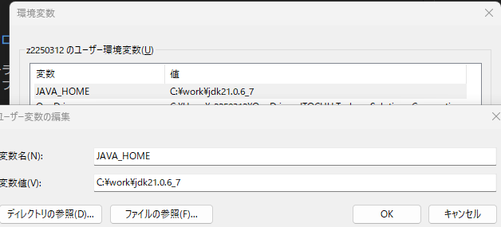
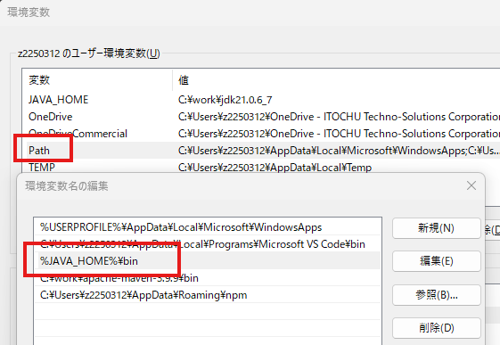
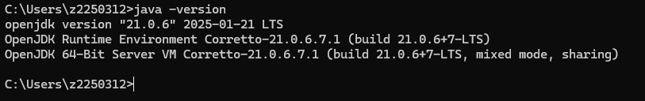

# 開発環境構築（java言語 eclipse編）

## 本手順書の位置づけ

Eclipse を用いた Java 開発の導入手順書です。

## 利用ツール

- VSCode

## VSCodeをダウンロード・インストールする

以下よりインストーラを取得し、PCへインストールする。既に作業環境に導入されている場合は手順をスキップする。

- VSCode配布先  
https://code.visualstudio.com/ 

## OpenJDKを導入する

### OpenJDKダウンロードする

Amazon Corretto（OpenJDK ディストリビューション）を以下よりダウンロードする。
https://aws.amazon.com/jp/corretto/

ダウンロード後、適当なディレクトリへ解凍する。

### 環境変数を設定する

JAVA_HOMEという変数名で解凍先のパスを設定する。

Pathへ%JAVA_HOME%\binを追加する。

### 導入確認

コマンドプロンプトより「java -version」を実行し導入したjavaが認識されていることを確認する。

## VSCodeに拡張プラグインを導入する

Java開発用途に以下プラグインを追加する。

- Extension Pack for Java

#### テストなどを実行する場合の注意点

テストクラスをコンテキストメニューから実行すると失敗することがある。
左下メニュー内のMAVEN内より実行する。

## プロジェクトの追加（git）

TODO 