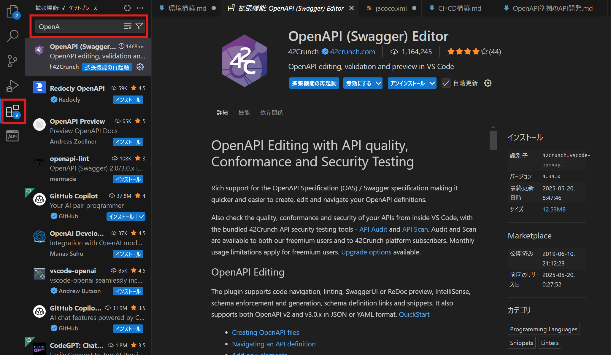
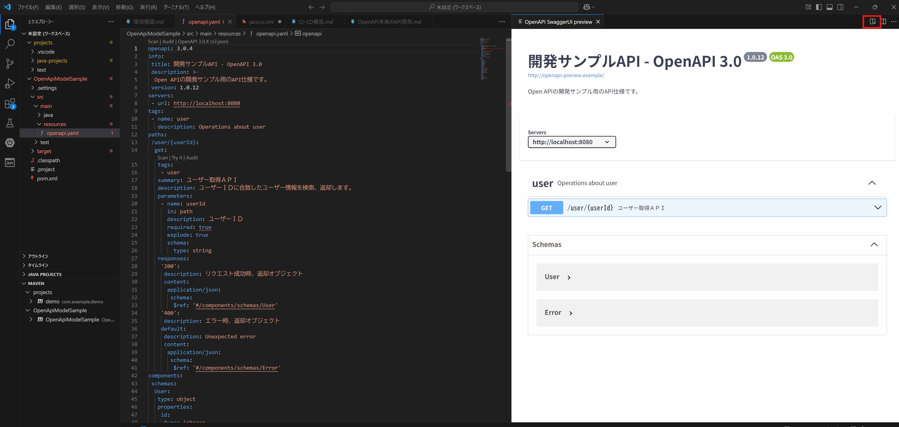

# 開発環境構築（OpenAPI編）

## 本手順書の位置づけ

OpenAPIファイル 開発の導入手順書です。

## 利用ツール

- VSCode
- OpenAPI(Swagger) Editor

## VSCodeをダウンロード・インストールする

以下よりインストーラを取得し、PCへインストールする。既に作業環境に導入されている場合は手順をスキップする。

- VSCode配布先  
https://code.visualstudio.com/ 

### VSCodeに拡張プラグインを導入する

アクティビティーバー（左縦に表示されているメニュー）内、拡張機能よりOpenAPI (Swagger) Editorをインストールする。

※初回インストール時、発行元の信頼性を確認されるが発行元を信頼＆インストールを押下する。




インストール後、エディタ上でのOpenAPI仕様に沿った構文チェック機能、エディタ右上プレビューボタンよりOpenAPI仕様に沿ったyamlファイルのプレビュー機能が利用可能となる。



## 各開発エディタに対してIFコードの自動生成設定を導入する。

以下の手順は、使用環境（エディタ・言語）に応じて実行してください。

### Java + Mavenプロジェクトでの開発を前提としたIF自動生成設定

OpenAPIファイルの管理には、別プロジェクトとして分離・管理する構成が推奨されています。※公式に明示的な推奨はされていませんが、実務上のベストプラクティスとして、技術記事や事例では広く推奨されています。

OpenAPIファイル（yaml）を プロジェクト/src/main/resources 配下に配置する。

pom.xmlへopenapi-generatorの定義(自動生成で利用される依存ライブラリとプラグイン)を追加する。

```xml

	<dependencies>
		<!-- 自動生成ソースに関連する依存を追加 -->
		<dependency>
			<groupId>org.springframework</groupId>
			<artifactId>spring-web</artifactId>
			<version>5.3.32</version> <!-- または 6.x 以降（Spring Boot に合わせる） -->
		</dependency>
		<dependency>
			<groupId>org.openapitools</groupId>
			<artifactId>jackson-databind-nullable</artifactId>
			<version>0.2.6</version>
		</dependency>
		<dependency>
			<groupId>javax.servlet</groupId>
			<artifactId>javax.servlet-api</artifactId>
			<version>4.0.1</version> <!-- Java EE 8相当 -->
			<scope>provided</scope> <!-- Webコンテナで提供されるため -->
		</dependency>
		<dependency>
			<groupId>org.springframework</groupId>
			<artifactId>spring-context</artifactId>
			<version>5.3.32</version>
		</dependency>
		<dependency>
			<groupId>io.swagger.core.v3</groupId>
			<artifactId>swagger-annotations</artifactId>
			<version>2.2.20</version>
		</dependency>
		<dependency>
			<groupId>javax.validation</groupId>
			<artifactId>validation-api</artifactId>
			<version>2.0.1.Final</version> <!-- Java EE 時代の安定版 -->
		</dependency>
		<dependency>
			<groupId>org.hibernate.validator</groupId>
			<artifactId>hibernate-validator</artifactId>
			<version>6.2.5.Final</version> <!-- 実装本体 -->
		</dependency>
	</dependencies>

	<build>
		<plugins>
			<plugin>
				<groupId>org.openapitools</groupId>
				<artifactId>openapi-generator-maven-plugin</artifactId>
				<version>7.4.0</version>
				<executions>
					<execution>
						<goals>
							<goal>generate</goal>
						</goals>
						<configuration>
							<inputSpec>${project.basedir}/src/main/resources/openapi.yaml</inputSpec>
							<generatorName>spring</generatorName>
							<output>${project.build.directory}/generated-sources/openapi</output>
							<configOptions>
								<interfaceOnly>true</interfaceOnly> <!-- IF のみ -->
								<skipDefaultInterface>true</skipDefaultInterface> <!-- DefaultApi など省略 -->
								<useTags>true</useTags> <!-- Tag 単位でファイル分割 -->
								<packageName>${project.artifactId}.openapi</packageName>
								<modelPackage>openapi.model</modelPackage>
								<apiPackage>openapi.api</apiPackage>
								<!-- TODO: ★★★pomとreadmeが生成される 以下設定が反映されない -->
								<skipPom>true</skipPom> <!-- pom.xml を生成しない -->
								<skipReadme>true</skipReadme> <!-- README.md を生成しない -->
							</configOptions>
						</configuration>
					</execution>
				</executions>
			</plugin>
		</plugins>
	</build>

```

追加後、各エディタのmaven実行機能よりmvn cleanなどを発行するとtarget配下にAPIインタフェースとモデルが生成される。